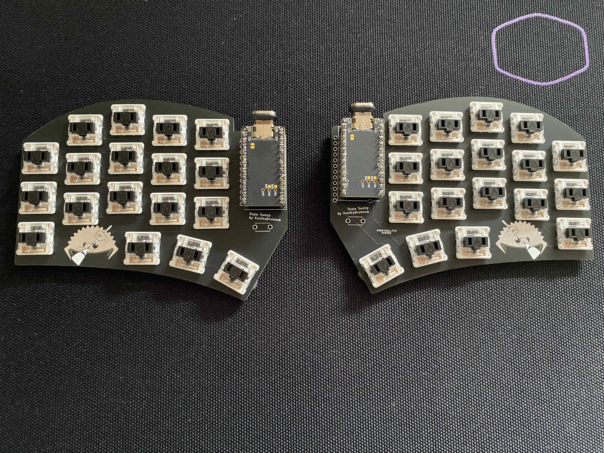

# DupaSweep
## An autogenerated split 36 key [Sweep](https://github.com/davidphilipbarr/Sweep) clone based on [ samoklava ](https://github.com/soundmonster/samoklava)

left | right
-|-
 | 

Without keycaps:

A 5x3 split keyboard with 3 thumb keys. There is nothing unique about the keyboard layout. It's practically choc mini Sweep keyboard with
extra key and no TRRS. I've removed TRRS to support diode-less build for wireless option.

Top outlines matches Exactly the original sweep outlines, bottom outlines are adjusted to the extra key.

Gerber files are available in [this directory](./gerbers). I've successfully managed to order it on
[JLPCB](https://jlcpcb.com/) website and it works well.

See the [workflow](.github/workflows/build.yml) or the [Makefile](ergogen/Makefile) for more details.

